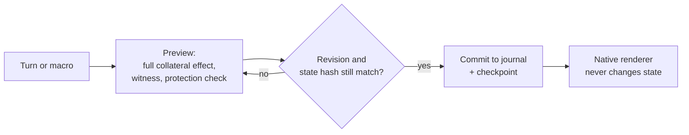

# Magic 600 Cell

**A solving workbench for the full 600-cell puzzle: a Rubik's-cube-style puzzle on a four-dimensional regular polytope.**

Built around **[Magic Puzzle Ultimate by Andrey Astrelin](https://superliminal.com/andrey/mpu/)**. Primary credit for the original puzzle simulator and renderer belongs to Andrey. Earlier versions of this project were named C600 Studio.

**[Download 0.4 for Windows](https://github.com/KonomiYuzu01/Magic-600-Cell/releases/tag/0.4)** · [Usage](USAGE.md) · [Release guide](docs/RELEASE_0_4.md) · [Mathematics](research/README.md) · [Documentation](docs/README.md) · [Roadmap to 1.0](#roadmap-10)

---

## The puzzle at a glance

The 600-cell is the four-dimensional regular polytope bounded by 600 tetrahedra. Its 120 vertices are the unit quaternions of the binary icosahedral group, and its symmetry group H4 has 14,400 elements. The puzzle version cuts it near every cell and lets each cell's cap turn, like a face of a Rubik's cube one dimension up.

| Quantity | Value |
| --- | --- |
| Cells (turnable caps) | 600 |
| Legal generators (half-turn and third-turn per cell) | 1,200 |
| Moving piece orbits | 35 |
| Surface pieces | 177,120 |
| Labelled sticker slots | 259,800 |

Every operation in the application acts on this complete model. Nothing is simplified: display filters and visibility settings never change the mechanical state or relabel a piece.

## What 0.4 does

- **A native solving workspace** with explicit Prepare / Macro / Cleanup operations.
- **Macros you can trust:** each reusable macro keeps a finite legal witness and its full collateral effect, so you see everything a sequence moves before you commit it.
- **Protection:** solved orbits can be locked, and every commit is checked against the protected-orbit constraints.
- **Recovery:** sessions are journaled with checkpoints; reset and import are transactional and validate their complete input before writing.
- **Inspection:** linked Current / Operation / After cycle views, orientation and buffer tools, and endgame families.
- **Input and exchange:** physical keyboard input with configurable key sets, and C600 / MPUlt v1 log exchange.

The user chooses and executes the solving steps; the application does not solve the puzzle automatically.

## Run 0.4

Download the Windows x64 portable ZIP, extract the complete folder, and open `Magic600Cell.exe`. Keep `Magic600Engine.exe` and `_internal` alongside it. No separate Python or compiler is needed. The native renderer requires .NET Framework 4.x and the supported [Managed DirectX runtime](DIRECTX.md).

The default G2 layout keeps the native puzzle visible. The alternate keyboard workspace is available with `Magic600Cell.exe --mode g1`. Personal data is stored separately under `%LOCALAPPDATA%\Magic600Cell\0.4`; older C600 Studio profiles are not automatically migrated. See [sessions and rollback](USAGE.md#sessions-and-rollback).

## Engineering principles

- **Exact mathematics first.** Geometry is checked in exact arithmetic over Z[φ] (the golden-ratio integers) by a [standard-library checker](research/audit/verify_regular_geometry.py). The model is fixed by an immutable [manifest](assets/manifest.json): any change to geometry, cuts, IDs, seeds or frames requires a new model identity and a migration.
- **Chronological, complete permutations.** Every macro is executed as source-to-destination permutations in order, with its full collateral effect. Preview revisions and full-state hashes are rechecked before commit.
- **No lost work.** Reset and import are transactional and recoverable, and the current preferences and recovery checkpoint are kept.
- **Evidence is labelled.** Release records separate source and fixture checks, synthetic geometry, actual Windows/DirectX runs and performance measurements. A headless result is never presented as a Windows, input or performance result.
- **Reproducible builds.** Releases carry a [source manifest](SOURCE_MANIFEST.json) and [provenance record](docs/RELEASE_0_4_PROVENANCE.json) that bind the frozen package inputs to their hashes.

## Mathematics

The [theory document](research/PUZZLE_THEORY.md) develops 15 lemmas and a combined theorem with the full 35-orbit census. It covers exact golden-ratio coordinates, incidence and duality, the radial homeomorphism to the three-sphere, binary icosahedral quaternions and the H4 symmetry group, cap signatures and local frames, parity and orientation invariants, conditional configuration bounds, and the difference between geometric symmetry and legal twists. The order of the full legal group is not asserted.

PDF and LaTeX sources: [puzzle theory](research/Full_600cell_Puzzle_Theory.pdf), [technical report](research/Full_600cell_Technical_Report.pdf).

## Roadmap: 1.0

0.4 is the last release of the 0.4 line; the planned 0.4.1 release was cancelled. 1.0 is a new application designed from scratch, keeping the mathematical contract, the protection rules and the model identity.

- **Stage 2 (now):** inventory of every 0.4 function, keep/redesign/delete decisions, a new interaction and visual design, renderer experiments, and an architecture freeze.
- **Renderer target:** all 259,800 sticker slots at full detail during the most complex animation, at an average of at least 30 fps with a 99th-percentile frame time of at most 33.3 ms, on a laptop RTX 4070 (8 GB). Direct3D 12 is the base; candidates are listed in the [renderer decision](docs/wiki/decisions/renderer-candidates.md). No renderer has qualified yet.
- **Correctness:** the 1.0 engine is proven equal to the 0.4 engine by a differential oracle before it replaces it.
- **Your data:** 0.4 sessions migrate one way into 1.0 from a locked copy; the original session directory is never modified.
- **Platforms:** Windows first. The engine, session store and command layer stay free of Windows-only code so that macOS and Linux versions can follow after 1.0.

The [1.0 architecture proposal](docs/architecture/1.0/README.md) is future documentation and partly superseded; current decisions are in the [engineering wiki](docs/wiki/index.md).

## How this project is developed

Development follows a written, review-gated process. The owner sets scope, design and releases. Claude (Anthropic) is the integrating developer, and Codex (OpenAI) independently checks plans and reviews every non-trivial change before it is committed; critical paths such as the engine, persistence and the model manifest need a valid review of the exact candidate. Each review finding gets a recorded disposition, and decisions are kept in a public [engineering wiki](docs/wiki/index.md). The rules are in [AGENTS.md](AGENTS.md); the [development guide](docs/development-guide/HUMAN_GUIDE.md) explains them for people.

## Repository guide

| Location | Purpose |
| --- | --- |
| [USAGE.md](USAGE.md), [release guide](docs/RELEASE_0_4.md) | Start here for the released application. |
| [work/experiments/magic600-04/](work/experiments/magic600-04/) | Released 0.4 workspace source and packaging inputs; the original path is retained for reproducibility. |
| Root Python modules, [native/](native/), [assets/](assets/) | Shared backend, retained native integration and immutable full-model assets. |
| [Build guide](docs/DEVELOPMENT.md) | Source layout, prerequisites and public-checkout limitations. |
| [RELEASE.json](RELEASE.json), [SOURCE_MANIFEST.json](SOURCE_MANIFEST.json) | Version identity and source inventory; [release provenance](docs/RELEASE_0_4_PROVENANCE.json) binds the frozen package inputs. |
| [research/](research/README.md) | Mathematical references, reports and audits, with their original version and evidence scope. |
| [docs/](docs/README.md) | Current documentation, historical records, 1.0 planning and the engineering wiki. |
| [tests/](tests/) | Headless regression tests for mechanics, persistence, process ownership and tooling; native regressions in `tests/native/`. |

Root launch scripts, `web/` and `packaging/` retain the earlier shared/0.3 paths; they are not the 0.4 portable-package entry point. The `work/experiments/magic600-04` name does not make the published 0.4 release a new experimental build.

Performance optimization of the 0.4 line has ended with the 0.4.1 cancellation. The [release record](docs/RELEASE_0_4.md) distinguishes verified checks from reused evidence and remaining limits. Historical performance measurements are not a 0.4 performance certification.

## Credits and license

Magic 600 Cell is a derivative work of Magic Puzzle Ultimate, © 2010 Andrey Astrelin, distributed under the same terms as the original project. Acknowledgements to ivan216 for source references and Nan Ma for historical solving material.

[Credits](CREDITS.md) · [MIT license](LICENSE) · [Third-party notices](THIRD_PARTY_NOTICES.md)
