# Glossary (M6)

Status: **draft for stage 2.** Generated by `build.py` from `terms.json`; edit the sources, not this page. One term per concept (charter M1). Each term enters at the learning level where it is first needed (charter M6, D7). The levels follow the steps of the [solving workflow](../solving-workflow.md) and are provisional until the owner decides the learning path; the UI locations are the planned surfaces of solving-workflow section 4, not a layout. Diagrams are rendered locally with the Mermaid CLI; sources and digests are in `diagrams/`.

## Levels

| Level | Name | Workflow step |
|---|---|---|
| L1 | Turning the puzzle | solving-workflow.md section 4.3 (Keyboard) |
| L2 | Orbits and protection | solving-workflow.md section 2 |
| L3 | Buffers and stars | solving-workflow.md section 3.1 |
| L4 | Placement, blocks and frames | solving-workflow.md sections 3.2, 3.3 and 4 |
| L5 | Orientation and the endgame | solving-workflow.md section 3.4 |
| L6 | Beyond the baseline | solving-workflow.md section 2 (pure controllers) |

## L1: Turning the puzzle

### Cap

The set of pieces cut off around one cell pole that turns as one unit; a legal turn rotates exactly one cap.


- First needed: L1 (Turning the puzzle)
- In the UI: Grip highlight in Local; the cap a key will turn
- Source: research/Full_600cell_Puzzle_Theory.tex, Lemma 6 (cap actions)

### Cell

One of the 600 tetrahedral cells of the 600-cell; each cell carries 433 sticker slots.


- First needed: L1 (Turning the puzzle)
- In the UI: Local and Global views (cell outlines); cell names such as C013 in inspection and filters
- Source: research/Full_600cell_Puzzle_Theory.tex, Lemma 3; assets/mesh.json (cells, base_stickers)

### Generator (primitive move)

One of the 1,200 legal basic turns, numbered 1 to 1200; a negative number is its inverse. Every operation expands into generators.


- First needed: L1 (Turning the puzzle)
- In the UI: Move counts, macro text, history
- Source: AGENTS.md (1,200 legal generators); core.py Model.move

### Grip

The choice of which cap the next twist turns; choosing a grip changes nothing in the puzzle state.


- First needed: L1 (Turning the puzzle)
- In the UI: Grip keys of the keyboard; grip marker in Local
- Source: solving-workflow.md section 4.3; research/Full_600cell_Technical_Report.tex (grips, twists)

### Label

The identity of the sticker that sits in a slot; the state of the puzzle is the list of all 259,800 labels.


- First needed: L1 (Turning the puzzle)
- In the UI: Inspection panel; exact-label progress; colour is drawn from the label
- Source: core.py PuzzleState (labels, state_hash)

### Piece

A rigid group of stickers that always moves together; a piece occupies one position and its stickers fill that position's slots.

- First needed: L1 (Turning the puzzle)
- In the UI: Picking, inspection and tracking act on pieces
- Source: core.py PuzzleState.piece; research/Full_600cell_Puzzle_Theory.tex, Lemma 6

### Sticker slot

A fixed place for one sticker; the full model has 600 x 433 = 259,800 slots. The mechanical state always keeps all of them; display filters may hide some from drawing, never from the state.


- First needed: L1 (Turning the puzzle)
- In the UI: Views draw all slots unless a display filter hides some; inspection shows slot numbers
- Source: AGENTS.md (Mechanics and model); assets/mesh.json

### Twist

A turn of the gripped cap in one legal direction; every twist is one of the 1,200 generators or its inverse.


- First needed: L1 (Turning the puzzle)
- In the UI: Twist keys; the move list and history
- Source: core.py Model.move (primitive IDs +-1..+-1200)

## L2: Orbits and protection

### Collateral

What a word moves outside the orbit being worked on; 23 of the 35 raw seeds have collateral, and it is always kept, never discarded.


- First needed: L2 (Orbits and protection)
- In the UI: Complete-effect panel; support and conflict lists before execution
- Source: solving-workflow.md section 2; assets/seed_atlas.json (collateral)

### Net and Strict checks

Net checks protection on the complete operation's end result; Strict checks after every generator. An unchecked part is shown as unchecked, never as safe.


- First needed: L2 (Orbits and protection)
- In the UI: Protection check mode in preview
- Source: solving-workflow.md section 2 (Boundaries, not intermediate steps)

### Orbit

A class of positions whose pieces legal moves can exchange; the 35 moving orbits are numbered O0 to O34, pieces never leave their orbit, and the 600 fixed cell-centre pieces never move and are not numbered.


- First needed: L2 (Orbits and protection)
- In the UI: Orbit selector; per-orbit progress and residuals; filters such as O33
- Source: assets/census.json (orbits); research/Full_600cell_Puzzle_Theory.tex (35-orbit census)

### Protection

The solver's instruction that an orbit, position, piece or block must not change; an operation that would change it is refused, not hidden.


- First needed: L2 (Orbits and protection)
- In the UI: Protection indicator on every view; conflict warnings in preview
- Source: session.py Session.preview and commit (protected orbits); solving-workflow.md section 3.3

### Seed

A legal word, one per orbit, whose effect on that orbit is a cycle of three pieces.


- First needed: L2 (Orbits and protection)
- In the UI: Macro base (per orbit); star construction details
- Source: solving-workflow.md section 2; core.py Model.certify_seed

### Stage order

The order of orbits in which every seed's collateral falls on orbits not yet solved, so that finished orbits stay solved at every macro boundary.


- First needed: L2 (Orbits and protection)
- In the UI: Orbit list order; next-orbit suggestions
- Source: solving-workflow.md section 2; technical report, 'Triangular stage invariant'

## L3: Buffers and stars

### Buffer

One of two fixed positions, A and B, chosen for an orbit; pieces pass through them while others are placed. A buffer is a place, not a piece.


- First needed: L3 (Buffers and stars)
- In the UI: A and B markers in Local; buffer keys
- Source: solving-workflow.md section 3.1

### Occupant

The piece currently sitting in a position; a buffer's occupant changes every time a star runs.

- First needed: L3 (Buffers and stars)
- In the UI: Inspection; buffer status line
- Source: solving-workflow.md section 3.1

### Relocation

The fixed word that moves the seed's three-cycle onto buffer A, buffer B and a reference position.

- First needed: L3 (Buffers and stars)
- In the UI: Star construction details
- Source: core.py Model.certify_seed (relocation); solving-workflow.md section 3.1

### Setup

A word S, chosen for a target, that carries the reference position to the target X without moving the buffers; a star runs S^-1 first and S last.


- First needed: L3 (Buffers and stars)
- In the UI: Prepare phase of the work sheet; proposed setups for a named target
- Source: solving-workflow.md sections 3.1 and 7; research/Full_600cell_Puzzle_Theory.tex, Lemma 15

### Star

The macro that cycles buffer A to B to target X; in chronological order it runs setup^-1, relocation^-1, the seed, relocation, setup (as Model.expand writes it). Its inverse cycles A to X to B.


- First needed: L3 (Buffers and stars)
- In the UI: Macro base (star macros); preview of the cycle
- Source: solving-workflow.md section 3.1; core.py Model.star_net and expand

### Target

The position X the solver wants to fill next; the solver always names it, the program never chooses it alone.

- First needed: L3 (Buffers and stars)
- In the UI: Target marker; candidate list with reasons
- Source: solving-workflow.md sections 3.3 and 7

## L4: Placement, blocks and frames

### Block

A group of pieces the solver declares as an achievement, with members, required positions or relations, a reference and a preservation policy; Home blocks and referenced blocks are distinct.


- First needed: L4 (Placement, blocks and frames)
- In the UI: Block panel; block boundary in Local; block protection
- Source: solving-workflow.md section 3.3

### Complete effect

Everything an operation does to all 259,800 labels, including regions hidden by filters; checks and protection always use it.


- First needed: L4 (Placement, blocks and frames)
- In the UI: Preview: cycles, collateral, support, conflicts
- Source: solving-workflow.md section 4.1

### Frame

An ordered choice of reference stickers that fixes how a piece or block is oriented; a transported frame is the same frame carried along by moves.

- First needed: L4 (Placement, blocks and frames)
- In the UI: Reference and frame display in Local; frame comparison of hidden buffers
- Source: research/Full_600cell_Puzzle_Theory.tex, Lemma 7; core.py star_net (frame checks)

### Home

The position where a piece belongs when the puzzle is solved.


- First needed: L4 (Placement, blocks and frames)
- In the UI: Home and current structure toggle; home(C...) filters
- Source: core.py Filters (home and current predicates); solving-workflow.md section 3.3

### Work sheet

A saved operation with its roles and three phases, Prepare, Macro and Cleanup; reusing it always triggers a fresh review.

- First needed: L4 (Placement, blocks and frames)
- In the UI: Work sheet editor; phase editor
- Source: solving-workflow.md section 4

## L5: Orientation and the endgame

### Orientation

How a piece sits in its position; a piece can be at Home but wrongly oriented.


- First needed: L5 (Orientation and the endgame)
- In the UI: Orientation marks in Local; orientation_wrong counts
- Source: core.py PuzzleState (orientation_wrong)

### Orientation group

The group of ways a piece of an orbit can be turned in place: trivial, C2, C5, D5 or A5; it limits what can remain in the last buffer.


- First needed: L5 (Orientation and the endgame)
- In the UI: Orbit details; endgame stage display
- Source: assets/census.json (orientation_group); solving-workflow.md section 3.4

### Orientation transfer

The operation P_X(q) = K_{X,q} K_X^-1, built from stars: on the working orbit it fixes every position and moves an orientation change from X to a buffer; like every star product, it may also move pieces of other orbits (collateral), which preview shows.


- First needed: L5 (Orientation and the endgame)
- In the UI: Endgame tools; both ends shown in preview
- Source: solving-workflow.md section 3.4

### Residual

What is still wrong in an orbit: pieces not at Home, wrong buffer occupants, wrong orientations and unknown frames; the final buffer may keep only a residual the orientation group allows.


- First needed: L5 (Orientation and the endgame)
- In the UI: Residuals panel per orbit; stage display; completion
- Source: solving-workflow.md section 3.4

## L6: Beyond the baseline

### Pure controller

A raw seed followed by corrections of all its collateral through previously built pure controllers; its net effect touches only its own orbit.

- First needed: L6 (Beyond the baseline)
- In the UI: Macro base (advanced); theory book
- Source: solving-workflow.md section 2; research/Full_600cell_Puzzle_Theory.tex (certificate C)
